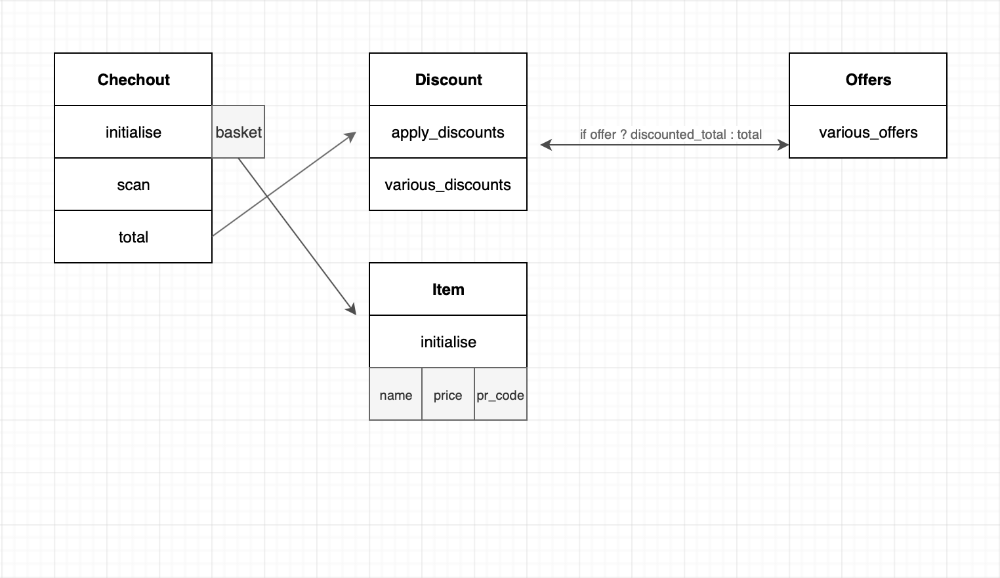

# The assignment

build a cashier function that adds products to a cart and displays the total price.

# The method to solve it

Thinking about the problem led to sketching the domain model.



Following the diagram I created four classes each having it's own responsibility.
Along side I created a test spec file for each class.

What followed was a TDD approach in which I wrote each test first and then wrote the code to make the test pass.

# Stepts to try it out

**clone the repo and run bundle install**

#### 1. Load the chechout class:

in the terminal run

`pry -r ./lib/checkout.rb`

#### 2.instantiate a checkout and product

```ruby
co = Checkout.new
```

#### 3. scan a product:

```ruby
green_tea = Item.new('green tea', 10, 'GR1')
co.scan(green_tea)
```

#### 4. check the total

```ruby
co.total
```

### Run the tests

```
bundle exec rspec --color
```
